# Contract and START Information Input

We used WINDING CREEKS II from DIV 1 for this particular example on the dev server. 
All of this is performed on the dev server and the production server was not touched.

## Purpose

Populate the contract information from the current contract with information regarding each plan and elevation.

## Process

Since the process is similar and the contract and START data are linked, I combined both of them into one.

### 1. Select the estimate to generate the contract information from or the STARTS form.

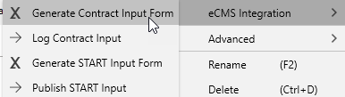

Right click on an estimate and go to 'eCMS Integration'.
Select either:
- 'Generate Contract Input Form'
- 'Generate START Input Form'

### 2. Fill out the Excel.

Once the excel is generated it will be saved into the currrent folder.
Then we fill out the salmon colored cells.

We want the forms to populate into a specified directory. (16 Input Forms?).

## Issues

Currently the biggest issue with the process is taht we cannt get the right tables populated.

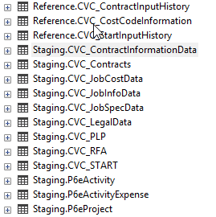

The STARTS and Contracts Process under eCMS Integration are not populating the relevant tables. 

Current they populate the Reference.CVC_ContractInputHistory and Reference.CVC_StartInputHistory tables. 

The tables we need them to fill out are the Staging Tables.

- Staging.CVC_ContractInformationData

## SOLVED ISSUES

### Grouping Error

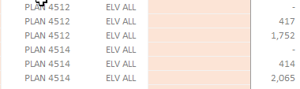

The first error happens when the contract is generated.
It tries to group the items by footprint quantity.

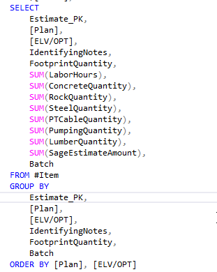

We managed to make it work by summing the footprint quantity and commenting out the footpring quantity grouping.

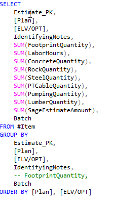

This gave us as result that is grouped correctly but is showing the wrong contract amounts.

### Incorrect Sage Totals

This is the result after the successful grouping.

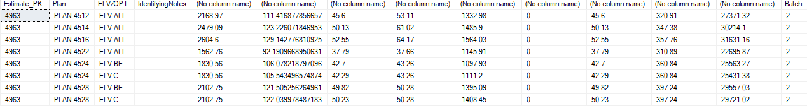

The results were around ~37% higher than the contract amount.
We managed to pinpoint the issue to the following code:

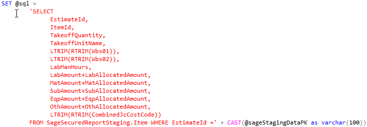

What we had found was that the issue is in the lines that add the Amount with the Allocated Amount.

I think the allocated amount is the markup amount. However I think the issue is that because the markups need to be on to run the 'Generate Contract Input Form' procedure, the original delta is applied twice and the math is very close.

When we look at plan 4512, we get the following results:

- 19995 / 13298 = ~1.5036
- 27371 / 13298 = ~2.0583

I could be mistaken on this but the math is pretty close.

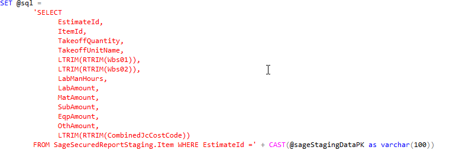

When we removed all those allocated amounts from the equations, we get the following results:

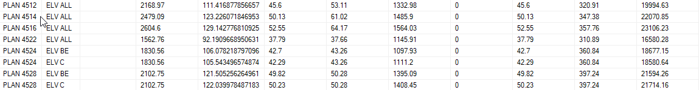

They seem to line up pretty well with the sage contract totals with the markups applied.

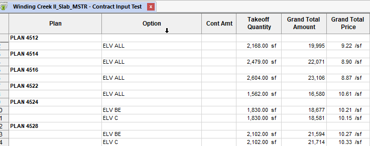

### Pulling Wrong Data

#### Information

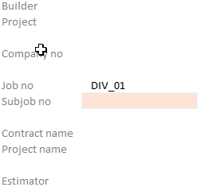

The Builder, Project, Company Number, Contract Name, Project Name, and Estimator are all either not pulling any data or pulling the wrong data.

The Job Number is pulling the Division Number.

#### START

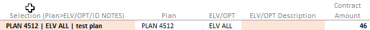

When we generate the START excel, it pulls from the wrong column.

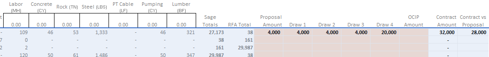

It currently pulls the data from the pumping column.

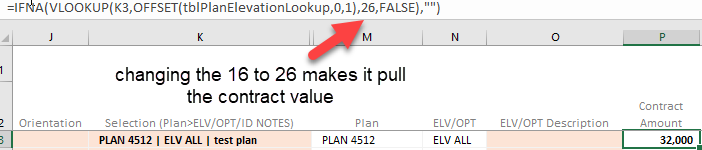

We managed to get it working with the above information.

#### Contract

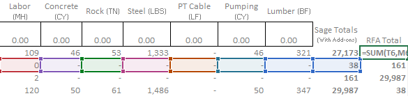

There seems to be an error with the RFA column.
It pulls information from the column below it and leads to wrong results.

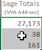

When we sum these values, we get 27,371. 
The contract amount is 19,995.

When we take first value divided by second value, we get ~1.369.

We wanted to know the formula that is being used to generate the Sage Total.
