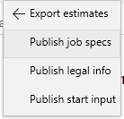
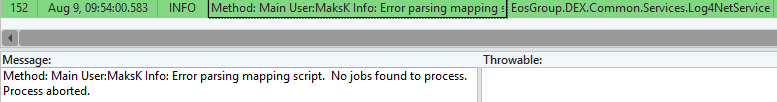
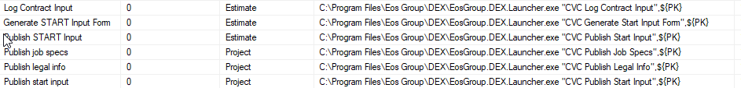

# User Defined Fields Input

This process was tested using WINDING CREEKS II from DIV 1.

## Purpose

This process will take the following User Defined Fields and then populate the staging tables with the information.

## Issues

When we click to run the processes below

We get the following error

And the relevant tables do not get populated. I believe that when I ran through this issue with Seth, we were able to pull the the information when we ran a custom query, but it did not publish into the Tables. See (Resources/PractiveRun.sql) for the query that we ran. I think it might be an issue with the xml not being located.

